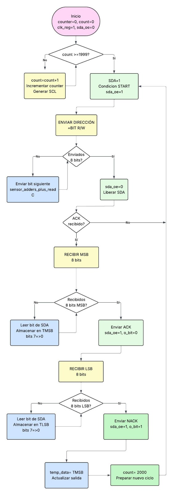
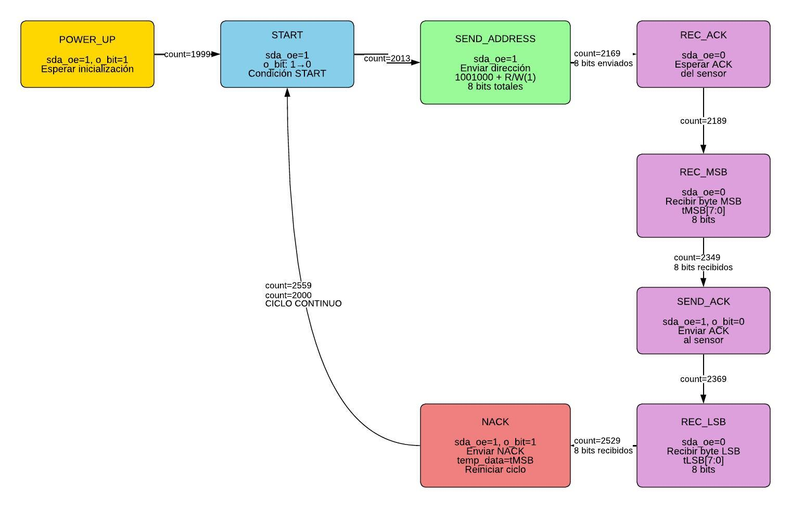
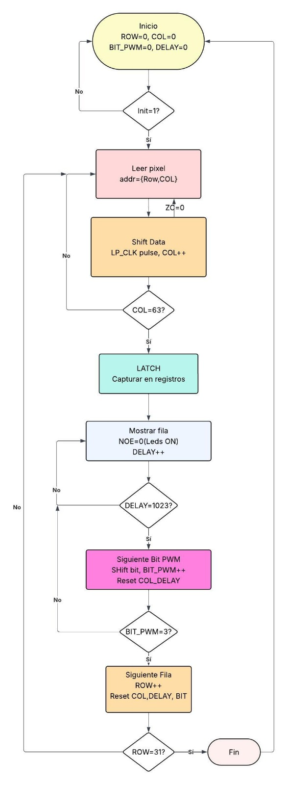
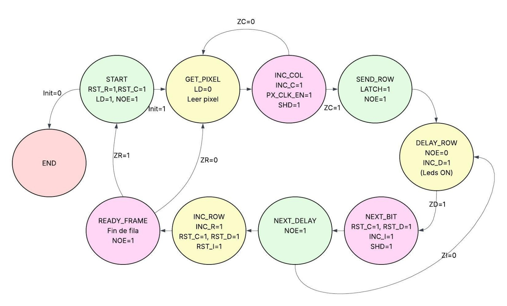

# Termómetro Digital con Matriz LED 64x64

Sistema embebido en FPGA que lee temperatura de un sensor LM75 vía I2C y la muestra en una matriz LED HUB75.

## Arquitectura del Sistema

```
┌─────────────────────────────────────────────────────────────┐
│                   COLORLIGHT 5A-75B (ECP5)                  │
│  ┌────────────┐  ┌───────────────┐  ┌────────────────────┐  │
│  │ i2c_master │→ │temp_converter │→ │led_temp_with_display│ │
│  │  (Sensor)  │  │  (°C → °F)    │  │   (Matriz LED)     │  │
│  └────────────┘  └───────────────┘  └────────────────────┘  │
└─────────────────────────────────────────────────────────────┘
         ↑                                      ↓
    ┌─────────┐                         ┌──────────────┐
    │  LM75   │                         │  Panel LED   │
    │ (Sensor)│                         │  64x64 HUB75 │
    └─────────┘                         └──────────────┘
```

---

## Diagrama del Sensor de Temperatura



---

## Diagrama de la Matriz LED




---

## Requisitos de Hardware

| Componente | Descripción |
|------------|-------------|
| FPGA | Colorlight 5A-75B (Lattice ECP5-25K) |
| Sensor | LM75 (I2C, dirección 0x48) |
| Display | Panel LED 64x64 HUB75 |
| Programador | FT232RL USB-Serial |

---

## Conexiones Físicas

### Sensor I2C (LM75)
| Señal | Pin FPGA |
|-------|----------|
| SDA | C4 |
| SCL | D4 |

### Panel LED HUB75
| Señal | Pin FPGA |
|-------|----------|
| CLK | M3 |
| LATCH | N1 |
| OE | M4 |
| A (ROW0) | N5 |
| B (ROW1) | N3 |
| C (ROW2) | P3 |
| D (ROW3) | P4 |
| E (ROW4) | N4 |
| R0 | J12 |
| G0 | K13 |
| B0 | J13 |
| R1 | G12 |
| G1 | H12 |
| B1 | H13 |

---

## Uso Rápido

### 1. Conectar el Hardware
```
1. Conectar sensor LM75 a los pines I2C (C4=SDA, D4=SCL)
2. Conectar panel LED 64x64 al conector HUB75
3. Conectar programador FT232RL vía USB
4. Alimentar la FPGA y el panel LED
```

### 2. Compilar
```bash
make all
```
Este comando ejecuta:
- **Síntesis** (Yosys) → `build/temp_display_final.json`
- **Place & Route** (nextpnr) → `build/temp_display_final.config`
- **Bitstream** (ecppack) → `build/temp_display_final.bit`

### 3. Programar la FPGA
```bash
make prog
```

### 4. ¡Listo!
La matriz LED mostrará:
- **Temperatura en °C** (rojo, lado izquierdo)
- **Temperatura en °F** (azul, lado derecho)

---

## Comandos Disponibles

| Comando | Descripción |
|---------|-------------|
| `make all` | Compila todo el proyecto |
| `make prog` | Programa la FPGA |
| `make sim` | Ejecuta simulación |
| `make clean` | Limpia archivos generados |

---

## Estructura del Proyecto

```
IntentoDigital/
├── Makefile                    # Comandos de compilación
├── LedDisplay/
│   ├── colorlight_5a.lpf       # Constraints (pines)
│   ├── temp_display_top_final.v  # Módulo TOP
│   ├── led_temp_with_display.v   # Controlador matriz
│   ├── temp_pixel_generator.v    # Generador de texto
│   ├── digit_5x7_rom.v           # Fuente de dígitos
│   ├── ctrl_lp4k.v               # FSM de control
│   ├── count.v                   # Contador genérico
│   ├── comp.v                    # Comparador
│   └── mux_led.v                 # Multiplexor PWM
└── SensorTemp/
    ├── i2c_master.v              # Maestro I2C
    ├── clkgen_200KHz.v           # Generador de reloj
    ├── temp_converter.v          # Conversor °C→°F
    ├── multiply_by_9.v           # Multiplicador
    ├── divide_by_5.v             # Divisor
    └── add_32.v                  # Sumador
```

---


